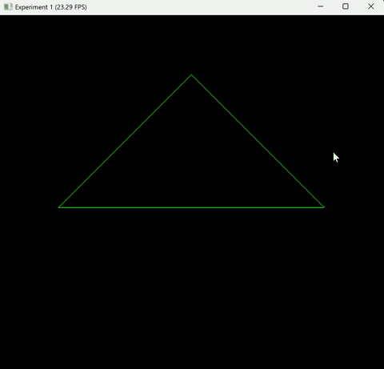

# 实验二：旋转与变换
***
- 姓名：韦钰舸
- 学号：202311030019
- 专业：24人工智能

## 实现功能

**模型变换**：物体绕Z轴的旋转矩阵构建，通过键盘控制旋转。

**视图变换**：实现相机位置的平移变换，将世界坐标系物体正确转换至相机视点空间。

**透视投影变换**：将透视平截头体挤压为正交长方体，进行正交投影缩放映射。

**线框渲染**：基于 DDA画线算法在像素画布中实时绘制三角形线框，通过A、D键控制逆时针与顺时针旋转。

***

## 实现思路

1. **矩阵构建**：
   - **Model**：利用弧度制下的三角函数构建3D绕z轴齐次旋转矩阵。
   - **View**：对相机位置 `eye_pos` 取逆向平移分量，构造平移齐次矩阵。
   - **Projection**：首先通过场视角和宽高比计算出视锥体的上下左右边界，再结合近平面和远平面构建透视转正交矩阵与正交投影矩阵，二者相乘得到完整的投影矩阵。
2. **顶点变换**：
   对于初始的三维顶点，按照列向量右乘规则进行复合变换
3. **透视除法与视口映射**：
   对变换后的齐次坐标分量透视除法，顶点归一化到NDC 空间。最后通过线性映射，将X和Y坐标缩放到屏幕的分辨率区间&#x20;
4. **光栅化连线**：
   将映射后的屏幕像素坐标传入 DDA 算法，步进计算像素格子并对 `taichi.Vector.field` 画布进行颜色填充。

***
## 函数实现代码

以下是项目中三个核心齐次坐标变换矩阵函数的具体代码实现。

### 1.  `get_model_matrix`
```python
@ti.func
def get_model_matrix(angle: ti.f32):
    # 1. 将角度制转换为弧度制
    rad = angle * 3.1415926535 / 180.0
    cos_r = ti.cos(rad)
    sin_r = ti.sin(rad)
    
    # 2. 构建并返回绕 Z 轴旋转的 4x4 齐次矩阵
    return ti.Matrix([
        [cos_r, -sin_r, 0.0, 0.0],
        [sin_r,  cos_r, 0.0, 0.0],
        [  0.0,    0.0, 1.0, 0.0],
        [  0.0,    0.0, 0.0, 1.0]
    ])

```
### 2.  `get_view_matrix`
```python
@ti.func
def get_view_matrix(eye_pos_x: ti.f32, eye_pos_y: ti.f32, eye_pos_z: ti.f32):
    # 构建平移齐次矩阵，将整个世界坐标系向相机位置的反方向平移
    return ti.Matrix([
        [1.0, 0.0, 0.0, -eye_pos_x],
        [0.0, 1.0, 0.0, -eye_pos_y],
        [0.0, 0.0, 1.0, -eye_pos_z],
        [0.0, 0.0, 0.0,        1.0]
    ])

 ```
### 3.  `get_projection_matrix`
```python
@ti.func
def get_projection_matrix(eye_fov: ti.f32, aspect_ratio: ti.f32, zNear: ti.f32, zFar: ti.f32):
    # 1. 角度转弧度，并定义符合右手坐标系约定的近、远平面 Z 轴坐标
    fov_rad = eye_fov * 3.1415926535 / 180.0
    n = -zNear
    f = -zFar
    
    # 2. 根据垂直视场角计算视锥体边界（利用对称性简化）
    t = ti.tan(fov_rad / 2.0) * zNear
    b = -t
    r = aspect_ratio * t
    l = -r
    
    # 3. 构建透视挤压矩阵 M_p2o：将锥形平截头体压缩为长方体
    M_p2o = ti.Matrix([
        [n,   0.0, 0.0,   0.0],
        [0.0, n,   0.0,   0.0],
        [0.0, 0.0, n + f, -n * f],
        [0.0, 0.0, 1.0,   0.0]
    ])
    
    # 4. 构建正交投影矩阵 M_ortho：平移并缩放到 [-1, 1]^3 的 NDC 空间
    M_ortho = ti.Matrix([
        [2.0 / (r - l), 0.0,           0.0,            0.0],
        [0.0,           2.0 / (t - b), 0.0,            0.0],
        [0.0,           0.0,           2.0 / (n - f),  -(n + f) / (n - f)],
        [0.0,           0.0,           0.0,            1.0]
    ])
    
    # 5. 组合矩阵（按从右往左的应用顺序：先挤压，再正交投影）
    return M_ortho @ M_p2o

```
***
## 实现效果


***
## 运行方式


- Python 3.12+
- Taichi 1.7.4

