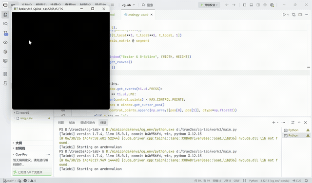

# 实验三：贝塞尔曲线

***

- 姓名：韦钰舸
- 学号：202311030019
- 专业：24人工智能

## 实现功能

1.贝塞尔曲线绘制：通过 De Casteljau 算法实现贝塞尔曲线计算与GPU加速渲染

2.B样条曲线绘制（选做）：实现均匀三次 、B样条曲线，与绘制贝塞尔曲线模式切换

3.控制点管理：鼠标左键点击添加控制点， c 键清空所有控制点，b键切换贝塞尔/B样条模式

***

## 实现思路

### 1. 存储预分配 (任务1、5)

- **显存对象池技术**：为了动态渲染任意数量的控制点，在底层预分配容量为 100 的 `gui_points` 字段。未激活的坐标默认填充为 `[-10.0, -10.0]`隐藏于可见视口之外。当用户点击鼠标时，更新前N个有效坐标并批量拷贝至 GPU，以静态显存结构支撑动态交互。
- **数据缓冲区**：

  `pixels` 用于存储像素最终输出颜色的画布。

  `curve_points_field` 用于接收离散采样点，帮助CPU与GPU之间进行曲线数据传递。


### 2. 贝塞尔曲线生成：De Casteljau 算法 (任务 2)

- **算法核心**：利用一维参数对控制点进行线性插值，通过逐层递归得到对应参数下的曲线唯一坐标，每轮循环中，遍历当前点集并对相邻两点应用算子，直到点集收缩到单个坐标。
- **离散采样**：对t采用 1000 次等距均匀采样，计算出所有离散采样点的二维浮点坐标，通过 `.from_numpy()` 算子拷贝到GPU 缓冲区 `curve_points_field`。


### 3. 均匀三次 B 样条曲线 (选作任务 2)

通过分段控制，将整条曲线分成多个小段，每段仅由少数几个控制点决定，实现移动一个控制点只影响曲线局部的局部控制特性，同时保持曲线阶数固定


### 4. 光栅化绘制内核 (任务 3)

- **数据并行处理**：通过 `@ti.kernel` 装饰器将绘制逻辑上推至 GPU 并行执行。
- **坐标转换**：`for i in range(n):` 循环会在 GPU 并行展开，各线程并行从 `curve_points_field` 中并行读取计算好的曲线浮点坐标。将原本属于\[0, 1]的归一化坐标乘以画布宽高，离散映射为对应的整型像素索引。


### 5. **主循环与**交互 (任务 4 & 选作交互)

- **左键点击 (`ti.ui.PRESS`)**：获取二维 NDC 坐标 `pos`，在未达到上限 100 的前提下追加进 CPU 端控制点队列。
- ** `C`** **键**：清空控制点列表，并将 GPU 对应的对象池数组重置为隐藏状态。
- **主同步更新**：每帧渲染循环中，若有效控制点数满足绘制阈值，首先在 CPU 侧触发相应曲线的离散插值生成，接着通过 PCIe 总线成批将数据拷入显存，最后调度 GPU 并行绘制，更新 `canvas.set_image(pixels)` 。
***

## 核心函数实现代码

### 1. 贝塞尔曲线De Casteljau算法 `de_casteljau`

```python
def de_casteljau(points, t):
    n = len(points)
    # 递归基：当缩减至最后一个点时，即为当前参数 t 下的曲线插值点
    if n == 1:
        return points[0]
    
    # 结合 NumPy 对相邻控制点进行一阶线性插值（LERP）
    new_points = [np.array((1 - t) * points[i] + t * points[i + 1], dtype=np.float32) for i in range(n - 1)]
    
    # 递归调用下一层
    return de_casteljau(new_points, t)
```

### 2.B 样条曲线 `b_spline`

```python
    def b_spline(points, t):
    n = len(points)
    # 均匀三次 B 样条至少需要 4 个控制点才能构建线段
    if n < 4:
        return None
    
    # 根据全局参数 t [0, 1] 定位当前处于哪一个局部 B 样条线段区间
    i = int(t * (n - 3))
    i = min(max(i, 0), n - 4)  # 边界防御，防止浮点数精度引发越界
    
    # 计算当前区间的局部参数 t_local [0, 1]
    t_local = t * (n - 3) - i
    
    # 均匀三次 B 样条的标准混合特征矩阵
    basis_matrix = np.array([
        [-1,  3, -3, 1],
        [ 3, -6,  3, 0],
        [-3,  0,  3, 0],
        [ 1,  4,  1, 0]
    ]) / 6.0
    
    # 提取当前片段依赖的 4 个控制点
    segment = np.array(points[i:i+4])
    
    # 构造参数时间幂向量并执行矩阵单步右乘运算
    t_vec = np.array([t_local**3, t_local**2, t_local, 1])
    return t_vec @ basis_matrix @ segment
```

***

## 实现效果



***

## 运行方式

- Python 3.12+
- Taichi 1.7.4

