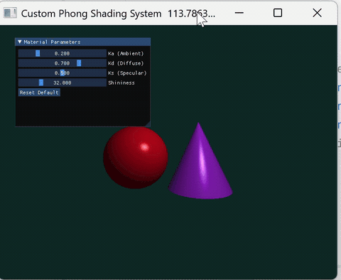

# 实验四：Phong光照模型

***

- 姓名：韦钰舸
- 学号：202311030019
- 专业：24人工智能

## 实现功能

### 1. 几何体构建


隐式定义深红色的球体（圆心 \[-1.2, -0.2, 0.0]，半径 1.2），紫色圆锥（顶点 \[1.2, 1.2, 0.0]，底面高度 y=-1.4，底面半径 1.2）。
光线同时击中多个物体时，选择距离相机最近的交点进行着色，确保正确的物体遮挡与空间前后关系。

### 2. Phong光照模型着色


计算交点处的环境光、漫反射以及镜面高光三项分量进行线性叠加，镜面高光基于入射光线的反射向量R与视线向量V的点乘夹角进行计算，呈现平滑材质高光。

### 3. 硬阴影光线追踪

在主光线击中物体的交点处，向点光源方向发射一条暗影射线，若暗影射线在到达光源前击中场景中的其他几何体，则判定该点处于阴影之中，此时只计算环境光，呈现硬阴影遮挡效果。

***

## 实现思路

### 1. 视口变换与主光线生成
将屏幕上每个离散的像素坐标进行归一化映射。通过将像素索引与画布的总宽高进行比例换算，统一转换到三维观察空间的视口中。以固定在空间中的相机作为光线的起点，根据归一化后的视口位置计算出每个像素对应的一条光线方向向量。每条主光线可以看作是从相机出发、穿过屏幕对应像素、并向三维场景深处无限延伸的射线。

### 2. 解析法几何体求交测试

- **球体求交**：联立射线与球体的代数方程，通过求解一元二次方程的判别式，判断光线是否击中球体，并提取出代表最近交点的正实数距离。
- **圆锥求交**：将射线起点平移到以圆锥顶点为原点的局部坐标系中。利用圆锥的二次表面隐式方程求解交点，并在求解后加入垂直高度的截断范围判定，裁剪出一个有限高度的圆锥。

### 3. 深度竞争与法线计算
在并行计算循环中，每一条主光线都会同时与场景中的球体和圆锥进行求交。通过比对两者的交点距离，动态选择维护一个最近距离，只有最近的交点才会被记录并进入到着色阶段
确定最近击中的物体后，计算交点处的表面法线，球体的法线由交点向球心做差；对隐式方程求梯度，得到圆锥的侧面法线，确保法线完全垂直于圆锥斜面。

### 4. 硬阴影追踪
在主光线击中的交点处，向光源所在的位置发射一条二次射线，即暗影射线。
让暗影射线与场景中的所有物体再次进行求交计算。如果这条射线在到达光源之前撞击到了球体或圆锥，则说明该交点被其他物体挡住了，属于光线照不到的阴影区。

### 5.Phong着色模型
- **环境光**：表现物体在没有光线直射时由周围环境散射产生的基本亮度，数值由环境光系数与物体材质颜色决定。
- **漫反射**：表现物体表面对入射光的均匀散射。其亮度由表面法线与光源方向的夹角决定，夹角越小越亮。
- **镜面高光**：表现光滑表面的反光质感。首先根据入射光和法线计算反射光向量，高光的强弱由该反射光向量与观察者视线向量的夹角决定。夹角越小，高光越汇聚、越亮。
- **色彩整合与截断**：如果判定点在阴影区，则该像素只保留环境光颜色；如果在点亮区，则将环境光、漫反射、镜面高光三者进行线性叠加。使用色彩截把所有颜色通道限制在合法范围内，防止局部区域过曝变白，输出到像素场显示。

***

## 函数实现代码
1. 球体相交intersect_sphere
```python
@ti.func
def intersect_sphere(origin, direction, center, radius):
    oc = origin - center
    a = direction.dot(direction)
    b = 2.0 * oc.dot(direction)
    c = oc.dot(oc) - radius * radius
    discriminant = b * b - 4 * a * c
    t = -1.0
    if discriminant >= 0:
        t = (-b - ti.sqrt(discriminant)) / (2.0 * a)
        if t < 1e-4:
            t = (-b + ti.sqrt(discriminant)) / (2.0 * a)
    return t
```
2. 圆锥相交intersect_cone 侧面法线cone_normal
```python
@ti.func
def intersect_cone(origin, dir, apex, height, radius):
    k = radius / height
    k2 = k * k
    co = origin - apex
    a = dir.x * dir.x + dir.z * dir.z - k2 * dir.y * dir.y
    b = 2.0 * (co.x * dir.x + co.z * dir.z - k2 * co.y * dir.y)
    c = co.x * co.x + co.z * co.z - k2 * co.y * co.y
    
    t_res = -1.0
    disc = b * b - 4.0 * a * c
    if disc >= 0:
        sqrt_disc = ti.sqrt(disc)
        t1 = (-b - sqrt_disc) / (2.0 * a)
        t2 = (-b + sqrt_disc) / (2.0 * a)
        if t1 > t2: t1, t2 = t2, t1
            
        if t1 > 1e-4:
            y = co.y + dir.y * t1
            if -height <= y <= 0.0:  # 局部高度范围裁剪
                t_res = t1
        if t_res < 0 and t2 > 1e-4:
            y = co.y + dir.y * t2
            if -height <= y <= 0.0:
                t_res = t2
    return t_res

@ti.func
def cone_normal(p, apex, height, radius):
    k = radius / height
    k2 = k * k
    p_local = p - apex
    n = normalize(ti.Vector([p_local.x, -k2 * p_local.y, p_local.z]))
    return n
```
3. 着色部分 render
```# 位于 render 内的并行循环中
if t_min < 1e8:
    if n.dot(ray_dir) > 0:
        n = -n  # 双面法线修正
    
    if is_in_shadow(light_pos, p, n, sphere_center, sphere_r, cone_apex, cone_h, cone_r):
        final_col = Ka[None] * light_color * col  # 阴影区只计算环境光
    else:
        L = normalize(light_pos - p)
        V = normalize(view_pos - p)
        
        # 标准 Phong 模型的反射向量 R
        R = tm.reflect(-L, n).normalized()
        
        ambient = Ka[None] * light_color * col
        diffuse = Kd[None] * ti.max(0.0, n.dot(L)) * light_color * col
        specular = Ks[None] * ti.pow(ti.max(0.0, R.dot(V)), shininess[None]) * light_color
        
        final_col = ambient + diffuse + specular
        
img[i, j] = tm.clamp(final_col, 0.0, 1.0)
```
***

## 实现效果



***

## 问题及解决方法

屏幕视口坐标系映射问题
Taichi的ti.ndrange默认的内存及画布坐标系是左下角为原点(0,0)，且j轴向上递增，原代码使用左上角为原点的翻转公式，导致射线的y方向与真实世界坐标系相反。

```python
screen_x = ((i + 0.5) - width // 2) / (height // 2)
screen_y = (height // 2 - (j + 0.5)) / (height // 2)
```

解决方法：

- 对比实验参考代码并调整，将屏幕坐标映射到正确的坐标系

```python
screen_x = (i - width / 2.0) / height * 2.0
screen_y = (j - height / 2.0) / height * 2.0
```

***

## 运行方式

- Python 3.12+
- Taichi 1.7.4

