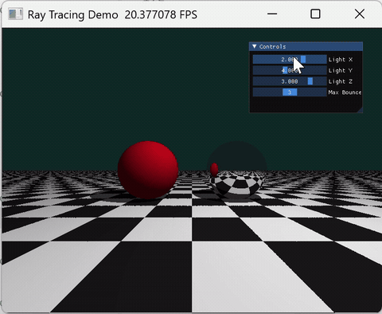

# 实验五：光线追踪

***

- 姓名：韦钰舸
- 学号：202311030019
- 专业：24人工智能

## 实现功能

### 1.三维隐式场景

平面：y=-1.0隐式构建无限延伸的地面，计算交点坐标的奇偶性，渲染出黑白相间的精密棋盘格纹理。

红色漫反射球：圆心 \[-1.5, 0.0, 0.0]，半径 1.0，纯漫反射材质。

纯镜面球：圆心 \[1.5, 0.0, 0.0]，半径 1.0，高反射率的纯镜面反射材质，能反射出左侧红球和地面。

### 2.循环光线弹射

在每个像素的计算中引入了定长 for 循环来模拟光线的多次追踪路径，当光线击中镜面球时，动态更新光线的起点与方向，并乘以反射率系数使其继续弹射；当中途击中漫反射物体或未击中物体时，立即计算当前光照并终止循环

### 3.硬阴影互遮挡

球体自身会在棋盘格地面上投射出清晰的阴影轮廓，两个球体之间、以及球体对自身的不同区域也会产生正确的相互阴影遮挡效果。

### 4.动态交互

拖动滑块改变点光源的空间坐标，观察投影移动现象。滑动Max Bounces对比无镜面反射与弹射次数大于1时的显示变化。

***

## 实现思路

### 1. 光线生成

对屏幕上的每一个离散像素，首先进行视口空间的归一化对齐，防止画面产生形变或方向颠倒。以固定在空间中的相机作为光线的统一起点，根据归一化后的像素位置计算出每一条初始光线的方向向量，使其向场景深处无限延伸。


### 2. 光线求交

光线进入场景后，并行地与场景中的所有几何体进行代数求交计算：

- **平面求交**：联立射线方程与平面方程，计算光线与地面的交点，并根据交点在空间中的坐标奇偶性计算出黑白相间的棋盘格纹理。
- **球体求交**：射线与球体的解析几何方程，通过求解一元二次方程的判别式，计算光线与左、右球体的交点。
- **深度测试**：当一条光线同时与多个几何体存在交点时，系统动态比对所有合法的正实数距离，选择距离当前相机最近的有效交点作为当前命中点，确保物体间正确的空间前后遮挡关系。


### 3. 材质着色模型

- **漫反射**：地面黑白棋盘格与红色球对应漫反射模型，表面对入射光产生均匀的散射，亮度主要取决于碰撞点表面法线与光源方向的夹角。
- **镜面**：右侧球对应镜面反射，在当前相交点追踪反射方向，并将其作为当前像素的色彩来源。


### 4. 光线反弹

在每次光线命中镜面物体后，将当前交点更新为下一次追踪的全新光线起点。根据光线的入射方向与命中点处的表面法线，精确解算出完美的镜面反射光线方向。在进入下一次反弹前，光线吞吐量乘该镜面物体的反射率系数，模拟光线在传输与反射过程中造成的能量物理衰减。系统最多支持固定次数的反弹中途如果光线射向虚空，或者击中了漫反射材质，累加当前颜色提前终止反弹循环。


### 5. 阴影与光照计算

在发射二次射线时，人为将射线起点沿着法线方向微调偏移物理距离。暗影射线在到达光源前如果被场景中其他任何几何体拦截，则判定该点处于阴影区，该像素只保留基础的环境光照；若未被任何物体遮挡，则判定处于点亮区，计算完整的环境光与漫反射光照。最终将计算出的局部光照颜色乘当前累积的光线吞吐量，叠加到最终像素颜色中。

***


## 函数实现代码
### 1. 平面求交与棋盘格 (intersect_plane get_plane_color)
```python
@ti.func
def intersect_plane(ro, rd):
    # 地面固定在 y = -1.0 处，其法线完全朝上 [0.0, 1.0, 0.0]
    t = -1.0
    if ti.abs(rd.y) > 1e-5:  # 防止光线与地面平行导致除以零错误
        t = (-1.0 - ro.y) / rd.y
    return t

@ti.func
def get_plane_color(p):
    # 通过碰撞点 X 轴与 Z 轴空间坐标的奇偶性来动态划分网格
    scale = 1.0
    chk = ti.floor(p.x * scale) + ti.floor(p.z * scale)
    color = ti.Vector([0.9, 0.9, 0.9])  # 默认设置为白色格子
    if int(chk) % 2 == 0:
        color = ti.Vector([0.1, 0.1, 0.1])  # 偶数区域切换为黑色格子
    return color

```

### 2. 阴影检测
```python
@ti.func
def is_in_shadow(p, n):
    l_pos = light_pos[None]
    shadow_dir = normalize(l_pos - p)
    # 【避坑核心】：顺着表面法线方向向外微调 1e-4，规避自相交 Bug
    shadow_origin = p + n * 1e-4 
    dist_to_light = (l_pos - p).norm()
    
    in_shadow = False
    # 依次测试暗影射线是否会被地面、左球、右球拦截
    t_p = intersect_plane(shadow_origin, shadow_dir)
    if 1e-4 < t_p < dist_to_light:
        in_shadow = True
        
    if not in_shadow:
        t_s1 = intersect_sphere(shadow_origin, shadow_dir, ti.Vector([-1.5, 0.0, 0.0]), 1.0)
        if 1e-4 < t_s1 < dist_to_light:
            in_shadow = True
            
    if not in_shadow:
        t_s2 = intersect_sphere(shadow_origin, shadow_dir, ti.Vector([1.5, 0.0, 0.0]), 1.0)
        if 1e-4 < t_s2 < dist_to_light:
            in_shadow = True
            
    return in_shadow
```
### 3.迭代弹射 (render)
```python
# 位于 render 像素并行循环内部的光线追踪迭代
throughput = ti.Vector([1.0, 1.0, 1.0])  # 初始化光线能量吞吐量
final_color = ti.Vector([0.0, 0.0, 0.0])  # 初始化累计接收色彩

for bounce in range(max_bounces[None]):    # 通过固定循环模拟多次弹射
    # ... [深度竞争测试，找出最近击中的物体 hit_obj] ...
    
    if hit_obj == 0:
        # 未击中任何物体，融入深青色背景并彻底终止反弹
        final_color += throughput * ti.Vector([0.05, 0.15, 0.15])
        break
        
    if hit_obj == 1 or hit_obj == 2:
        # 漫反射材
        base_col = get_plane_color(hit_p) if hit_obj == 1 else ti.Vector([0.8, 0.1, 0.1])
        ambient = 0.2 * base_col
        diffuse = ti.Vector([0.0, 0.0, 0.0])
        
        if not is_in_shadow(hit_p, hit_n):
            L = normalize(light_pos[None] - hit_p)
            diffuse = 0.8 * ti.max(0.0, hit_n.dot(L)) * base_col
            
        # 当前材质贡献的色彩乘之前积攒的光线能量衰减系数
        final_color += throughput * (ambient + diffuse)
        break  # 漫反射表面不具备反射能力，直接 break 强行跳出追踪
        
    elif hit_obj == 3:
        # 更新光线起点
        ro = hit_p + hit_n * 1e-4
        # 根据经典光学公式，精确解算出反射光线作为下一轮迭代的方向
        rd = normalize(rd - 2.0 * rd.dot(hit_n) * hit_n)
        
        # 核心逻辑：光线每在镜面反弹一次，能量就要发生物理损耗（衰减率为 0.8）
        throughput *= 0.8

```

***

## 实现效果



***

## 运行方式

- Python 3.12+
- Taichi 1.7.4

