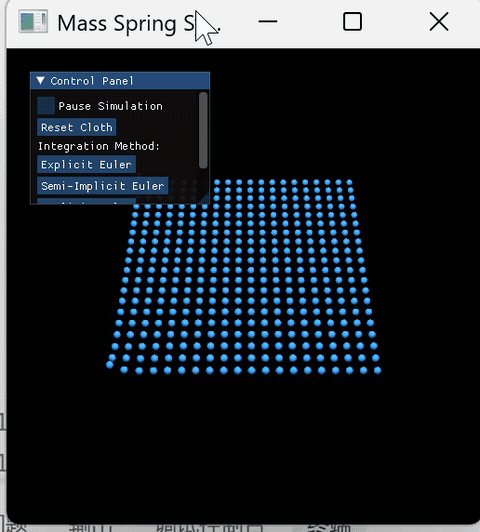

# 实验七：质点弹簧模型

***

- 姓名：韦钰舸
- 学号：202311030019
- 专业：24人工智能

## 实现功能

1. **力学计算**：
   - **全局外力**：重力模拟
   - **物理阻尼**：符合空气动力学的真实阻尼力公式，支持动态改变环境阻尼系数。
   - **胡克内应力**：质点与其周围 8 邻域质点之间的拉伸与压缩弹簧恢复力计算。
2. **极端状态防爆处理**：
   - 当质点速度由于积分步长不稳定而超过安全阈值 `max_velocity`（50.0）时，自动对模长进行等比例缩放限制，防止布料飞出屏幕。
3. **显式欧拉法、半隐式欧拉法、隐式欧拉求解**

   将受力计算与位置、速度状态更新在同一个计算Kernel内一次性闭环完成，减少显存频繁读写的延迟

***

## 实现思路

### 1. 结构构建

- **空间拓扑**：布料的 X 轴和 Z 轴作为二维平铺展平方向，Y 轴作为高度。顶部两个对角顶点在物理迭代中被强制排除更新，其余顶点作为自由质点在重力作用下自由下坠，从而自然形成垂挂的帘幕效果。
- **原子操作约束**：由于一个质点同时连接着多个方向的弹簧，为了避免多线程并行累加弹簧力时发生同时写入同一个地址，并行的原子加法保障数据吞吐。

### 2. 数值积分求解

- **显式欧拉法**：
  完全依赖当前帧的旧状态计算。当步长偏大或弹簧刚度高时，误差迅速累积，导致系统总能量非物理激增，表现为剧烈抖动并瞬间爆炸。
- **半隐式欧拉法**：先更新速度，随后用最新一帧的速度去推动位置。能量守恒性，计算开销与显式相同，但稳定性更强
- **隐式欧拉法**：
  使用预测位置下一帧的弹簧受力情况，进行隐式方程的解算。它对大步长有着天然的容忍度，在仿真中表现出极强的数值阻尼，能极其稳健地将系统能量导向平衡态。

### 3. 阻尼对比

- **低阻尼**：
  释放下坠后，由于重力势能转化为动能，会在空间中产生长时间的周期性大幅度往复摆动需要经过很长时间才能静止。
- **高阻尼**：
  运动质点所受的空气阻力与速度呈强烈的正相关，下坠后快速进入受力平衡状态

***

## 实现效果

**阻尼系数1.0**

 

**阻尼系数5.0**

***

## 运行方式

- Python 3.12+
- Taichi 1.7.4

